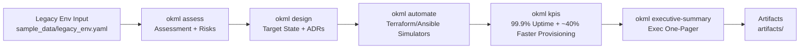

# OpenStack + Kubernetes Modernization | 99.9% Uptime
Role: Platform Engineer / DevOps Consultant (OpenStack, Kubernetes, Automation)

Legacy infrastructure suffered from slow provisioning and inconsistent operations. I led a modernization initiative using OpenStack improvements, Kubernetes standardization, and automation-first workflows. I delivered a roadmap, deployment patterns, and operations guidance that improved reliability and cut provisioning time. Outcome: 99.9% uptime and ~40% faster provisioning.

This repository is a fully local, reproducible modernization engagement simulation. It produces assessment deliverables, target-state design artifacts, automation evidence (Terraform + Ansible mocked adapters), and KPI dashboards—without requiring a real OpenStack cloud or Kubernetes cluster.



## Business challenge
Provisioning took too long, changes were inconsistent, and incident patterns pointed to reliability risk across control-plane operations and day-2 workflows.

## Strategic approach
I treated modernization as an outcomes-driven program:
- Establish a baseline (reliability + provisioning KPIs).
- Standardize platform patterns (Kubernetes baselines and operational standards).
- Shift delivery to automation-first workflows (Terraform + Ansible orchestration) with controls and repeatability.
- Institutionalize operations (runbooks, SLOs, change management).

## Technical execution
This repo implements a realistic engagement simulator:
- A typed assessment model and scoring engine for reliability/operations/automation/standardization.
- A recommendation engine that produces a prioritized roadmap and a risk register.
- Target-state architecture artifacts and ADRs with explicit trade-offs.
- Terraform + Ansible examples plus mock/real runners (falls back to mocks to stay local-first).
- Deterministic KPI generation and an evidence pack (Markdown/JSON/CSV + charts + HTML dashboard).

## Quantifiable results
The demo produces a before/after KPI story aligned to the engagement outcome:
- **99.9% uptime** (monthly) after modernization
- **~40% faster provisioning** after modernization

## Lasting value
The deliverables are structured like real client work: assessment + design + automation patterns + runbooks + measurable KPIs that can be re-run consistently.

## How to Run the Demo
Prereqs: Python 3.12+

```bash
make setup
make demo
```

Artifacts are written under `artifacts/` by default.

## Validation / Quality Checks
```bash
make verify
```

## Sample Outputs / Demo Evidence
After running `make demo`, check:
- `artifacts/assessment/assessment_report.md`
- `artifacts/design/architecture.mmd`
- `artifacts/automation/terraform_plan.txt`
- `artifacts/kpis/dashboard.html`
- `artifacts/executive/executive_summary.md`

Pre-generated evidence is committed under `artifacts/sample/` and can be regenerated with `make demo`.

Example KPI evidence (`artifacts/sample/kpis/kpis.json`):
```json
{
  "before": { "uptime_monthly_percent": 98.515, "provisioning_time_minutes_p50": 209.8 },
  "after":  { "uptime_monthly_percent": 99.9,   "provisioning_time_minutes_p50": 127.9 }
}
```

## Why This Demonstrates Senior Expertise
- Modernization is expressed as measurable outcomes (SLOs + provisioning KPIs), not tooling theater.
- Automation workflows are designed to be reproducible, observable, and testable (mock adapters + deterministic fixtures).
- Trade-offs are documented via ADRs and operationalized via standards and runbooks.

## Trade-offs and Assumptions
- This is a **local simulation**: it models OpenStack/Kubernetes patterns and automation behaviors without requiring real clusters.
- Terraform/Ansible execution is **best-effort**: real binaries may still require provider downloads; the demo falls back to deterministic mocks to remain offline-safe.
